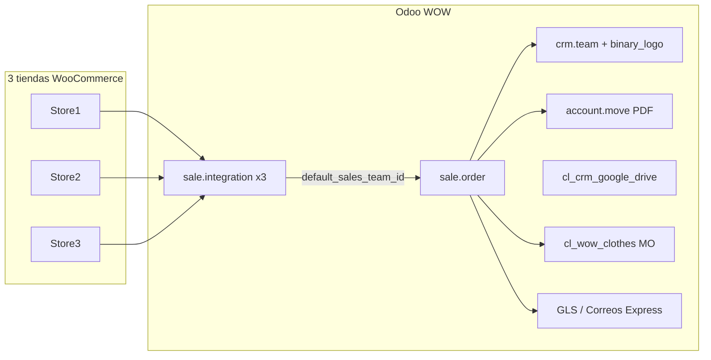
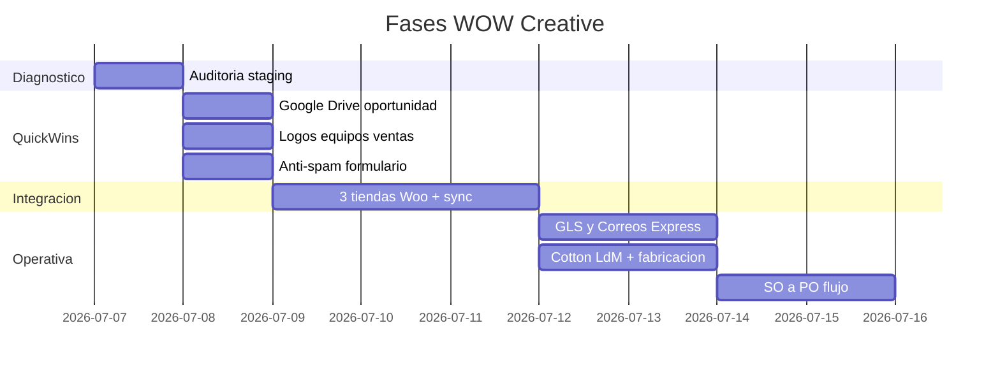

# Plan de correcciones WOW Creative (wow.conf + wowcreative-v17)

## Contexto técnico

**Stack operativo** ([wow.conf](wow.conf)):
- Odoo 17 con addons custom en [`/workspace/custom/wowcreative-v17`](/workspace/custom/wowcreative-v17)
- Conector e-commerce activo: **Ventor** (`integration` + `integration_woocommerce` en `server_wide_modules`)
- Cola de jobs: `queue_job`
- Transportistas disponibles en `addons_path`: [`/workspace/oca/carrier-connectors-v17`](/workspace/oca/carrier-connectors-v17) (GLS + Correos Express Vraja)

**Módulo legacy a ignorar**: `woo_commerce_ept` (Emipro, `active: False`). No usar para las 3 tiendas; el camino correcto es `sale.integration`.

---

## Fase 0 — Diagnóstico en staging (1 día)

Antes de tocar código, auditar la instancia WOW en staging:

| Área | Qué revisar |
|------|-------------|
| Integraciones | Registros `sale.integration` existentes, credenciales, webhooks, `default_sales_team_id`, jobs `queue_job` pendientes/fallidos |
| Equipos de venta | `crm.team` con `binary_logo` cargado ([wow_team_invoices](custom/wowcreative-v17/wow_team_invoices)) |
| Transportistas | Módulos instalados (`spain_gls_shipping_integration`, `correos_express_shipping_integration`, `common_shipping_integration_vts`), credenciales en `res.company`, último error al imprimir etiqueta |
| CRM/Drive | Leads vs oportunidades con carpeta creada indebidamente |
| Fabricación | Productos Cotton con LdM `normal` vs `phantom`; botón "Copy to Product Finale" |
| Compras | Si existe flujo previo de Andy (logs, módulos instalados: `sale_purchase`, rutas `buy` en productos/LdM) |

Documentar estado actual por cada punto para validar con Elena antes del despliegue.

---

## Punto 2 — Logos por tienda en presupuestos y facturación

### Estado actual
- [`wow_team_invoices`](custom/wowcreative-v17/wow_team_invoices) añade `binary_logo` en `crm.team` y lo usa **solo en PDF de facturas** (`account.move`), condicionado a `o._name == 'account.move'`.
- Ventor ya asigna equipo de ventas al importar pedidos vía `sale.integration.default_sales_team_id` ([integration_sale_order_factory.py](oca/ecommerce-integration/integration/models/integration_sale_order_factory.py) L55-56).
- Código antiguo de logos por website en [`sale_order_bk.py`](custom/wowcreative-v17/cl_product/models/sale_order_bk.py) está **comentado y no cargado**.

### Trabajo
1. **Configuración (sin código)**: por cada `sale.integration` (tienda Woo), asignar `Default Sales Team` al `crm.team` correspondiente y subir el logo en ese equipo.
2. **Extender `wow_team_invoices`** para que el logo también aplique en informes de **presupuesto/pedido de venta**:
   - Modificar las 4 plantillas en [`account_move_templates.xml`](custom/wowcreative-v17/wow_team_invoices/views/account_move_templates.xml) para aceptar `sale.order` además de `account.move` (en informes de venta, `o` ya se resuelve como `doc` vía `web.external_layout`).
   - Ejemplo de condición: `(o._name in ('account.move', 'sale.order') and o.team_id and o.team_id.binary_logo) or company.logo`
3. **Verificar propagación** `team_id` de SO → factura (estándar Odoo); si no llega, añadir dependencia `sale` en manifest y override mínimo en `account.move` solo si hace falta.
4. **Prueba**: importar pedido de cada tienda → imprimir presupuesto PDF y factura → logo correcto por marca.

---

## Punto 3 — Etiquetas GLS y Correo Express sin errores

### Estado actual
- Conectores en OCA Vraja: `spain_gls_shipping_integration` + `correos_express_shipping_integration` (+ `common_shipping_integration_vts` para Correos).
- WOW solo tiene [`cl_crm_delivery_carrier`](custom/wowcreative-v17/cl_crm_delivery_carrier) (propaga transportista CRM→SO→albarán); **no hay override de etiquetas**.
- Errores típicos documentados: dirección incompleta, teléfono destinatario obligatorio (GLS), `company_id` en transportista, `no_of_packages` sin rellenar, credenciales API.

### Trabajo
1. **Instalar y actualizar** módulos de transporte en staging (confirmar que no coexiste `delivery_correos_express` de OCA delivery-carrier — conflicto de `delivery_type`).
2. **Configurar credenciales** en `res.company` (URL GLS, UserId; usuario/clave/códigos Correos Express).
3. **Configurar transportistas** `delivery.carrier` con `delivery_type` correcto, servicio GLS, producto Correos, tipo de embalaje con dimensiones.
4. **Reproducir error real** con un albarán de prueba; corregir según causa:
   - Datos: validar `partner_shipping_id.phone/mobile`, CP, ciudad, país en pedidos Woo (extender mapping Ventor si faltan campos).
   - Técnico: si el error es del conector Vraja (p.ej. doble base64 en Correos), parche mínimo en módulo OCA o módulo puente `wow_delivery_labels` en custom.
5. **Prueba end-to-end**: SO confirmado → picking validado → "Enviar a transportista" → etiqueta PDF adjunta sin traceback.

---

## Punto 4 — Tres tiendas WooCommerce conectadas y pedidos funcionando

### Estado actual
- Arquitectura Ventor: **1 `sale.integration` = 1 tienda** con webhooks propios (`/integration/woocommerce/{id}/orders`).
- Manual operativo en [`docs/manual-integracion-ecommerce-odoo.md`](docs/manual-integracion-ecommerce-odoo.md).

### Trabajo
1. **Confirmar con Elena las 3 URLs** y crear/validar 3 registros `sale.integration` (credenciales REST, `order_name_ref` único por tienda, almacén, impuestos, estados de pedido).
2. **Asignar equipo de ventas** por integración (enlaza con punto 2).
3. **Webhooks** en cada Woo: `order.created`, `order.updated`, `product.*` apuntando a las URLs generadas por Odoo.
4. **Crons + queue_job**: verificar `import_order_enabled`, canal `root:3` en [wow.conf](wow.conf), workers procesando jobs.
5. **Prueba por tienda** (checklist):
   - Pedido nuevo en Woo → SO en Odoo con prefijo/ref correcto
   - Cliente creado/actualizado
   - Líneas con productos mapeados (SKU)
   - Workflow (confirmar/enviar según estado WC)
6. **Desinstalar o mantener bloqueado** `woo_commerce_ept` para evitar duplicidad de conectores.

---

## Punto 6 — Carpeta Google Drive al pasar a oportunidad (no al crear lead)

### Estado actual
- [`cl_crm_google_drive_integration`](custom/wowcreative-v17/cl_crm_google_drive_integration/models/crm_lead.py): el `create()` crea carpeta para **cualquier** `crm.lead` con nombre, sin filtrar `type`.

### Trabajo (cambio acotado en `crm_lead.py`)
1. **Eliminar** creación automática de carpeta del `create()`.
2. **Crear** método `_ensure_gdrive_folder()` reutilizando `_create_opportunity_folder()`.
3. **Disparar carpeta solo cuando**:
   - `type == 'opportunity'` en `create()` (oportunidades creadas directamente), o
   - `write()` cuando `type` pasa a `'opportunity'`, o
   - override de `convert_opportunity()` llamando a `_ensure_gdrive_folder()`.
4. **No crear carpeta** en leads (`type='lead'`) ni en conversiones que sigan siendo lead.
5. **Mantener** subida manual (`action_upload_production_files_to_gdrive`) y automática desde chatter.
6. **Prueba**: crear lead web → sin carpeta; convertir a oportunidad → carpeta creada; lead que no se convierte → sin carpeta.

---

## Punto 7 — Barrera anti-spam en formulario web

### Estado actual
- Solo [`cl_website_phone_validation`](custom/wowcreative-v17/cl_website_phone_validation): valida teléfono, **no anti-spam**.
- Odoo 17 trae `google_recaptcha` y `website_cf_turnstile` nativos (verificación en `/website/form`).

### Opciones (recomendación en orden)
| Opción | Esfuerzo | Efectividad |
|--------|----------|-------------|
| A. Activar **reCAPTCHA v3** o **Cloudflare Turnstile** (módulos core) | Bajo | Alta |
| B. Módulo custom **honeypot** en `cl_website_form_antispam` (campo oculto + tiempo mínimo de envío) | Medio | Media-alta |
| C. Lista negra de dominios/emails en controller | Bajo | Complementaria |

### Trabajo recomendado
1. Identificar qué formulario usa Elena (CRM lead, contacto, etc.).
2. Activar `google_recaptcha` o `website_cf_turnstile`, configurar claves en Ajustes.
3. Si piden "catchall" explícito: añadir módulo ligero `cl_website_form_antispam` extendiendo el controller de `cl_website_phone_validation` para rechazar envíos con honeypot relleno o emails de dominios bloqueados (lista configurable en `ir.config_parameter`).
4. **Prueba**: envío legítimo OK; bot/spam bloqueado.

---

## Punto 8 — Botón Cotton con LdM normal (no kit) para fabricación

### Estado actual
- Botón de Andy: **"Copy to Product Finale"** en [`product_template.xml`](custom/wowcreative-v17/cl_product/views/product_template.xml) → wizard [`wizard_duplicate_product`](custom/wowcreative-v17/cl_product/wizards/wizard_duplicate_product.py).
- Wizard tiene `bom_type` con **default `"phantom"` (Kit)**; Elena quiere **`"normal"` (A fabricar)** para Cotton.
- Flujo de fabricación activo en [`cl_wow_clothes`](custom/wowcreative-v17/cl_wow_clothes/models/sale_order.py): ya busca LdM `bom_type="normal"` al confirmar pedido.
- Botón **"Iniciar fabricación"** en vista de pedido está **comentado** en [`cl_product/views/sale_order_views.xml`](custom/wowcreative-v17/cl_product/views/sale_order_views.xml) L50-56 (la lógica existe en `cl_wow_clothes`).

### Trabajo
1. Cambiar **default de `bom_type` a `"normal"`** en el wizard (o detectar automáticamente si `quality_cl` es Cotton Sweet).
2. **Migración de datos**: revisar productos Cotton existentes con LdM `phantom` y convertirlos a `normal` (script SQL/XML-RPC puntual, no masivo sin validar).
3. **Reactivar botón** "Iniciar fabricación" en vista de pedido (descomentar XML o añadir en módulo `cl_wow_clothes`).
4. **Prueba Cotton**: duplicar prenda → LdM normal → pedido con personalización → confirmar → MO creada con componentes correctos.

---

## Punto 9 — Orden de compra al confirmar pedido de venta

### Estado actual
- **No hay desarrollo custom** SO→PO en wowcreative-v17.
- Existe PO solo desde **incidencias de fabricación** ([`wow_manufacturing`](custom/wowcreative-v17/wow_manufacturing/models/manufacturing_incidence.py)).
- Odoo estándar `sale_purchase` solo genera PO para **servicios** con `service_to_purchase`.

### Trabajo (requiere validar con Elena el flujo de Andy)
**Escenario más probable** para negocio textil: al confirmar SO, comprar **prendas en blanco / componentes de LdM** vía reglas de abastecimiento (`buy` route), no duplicar líneas del pedido.

1. **Reunión corta con Elena**: ¿PO de componentes LdM, de líneas SO, o subcontratación?
2. Según respuesta:
   - **Componentes LdM**: configurar rutas `buy` + proveedor en componentes; verificar que `action_confirm` de `cl_wow_clothes`/`cl_product` no bloquee procurement.
   - **Servicios subcontratados**: instalar `sale_purchase`, marcar productos `service_to_purchase`.
   - **Custom (si Andy tenía botón/wizard)**: buscar en histórico git/backup; si no existe, implementar módulo `wow_sale_purchase` mínimo que en `action_confirm` cree PO agrupada por proveedor para líneas configuradas.
3. **Prueba**: SO confirmado → PO en borrador con líneas esperadas → sin duplicados al reconfirmar.

> **Nota**: Este es el punto con mayor incertidumbre funcional; no implementar sin confirmar el flujo exacto.

---

## Punto 10 — Actualizar clientes, productos e información

### Trabajo operativo (Ventor)
1. **Productos**: wizard Import/Export por cada `sale.integration` → `import_product`, `export_stock`, revisar mappings `integration.product.template.external`.
2. **Clientes**: wizard import customers Woo + sync en import de pedidos.
3. **Referencias/SKU**: `action_woocommerce_sync_all_references()` si hay desalineación.
4. **Categorías, impuestos, estados**: reimportar si hubo cambios en Woo.
5. **Monitorizar** `queue_job` y `sale.integration.input.file` con errores.
6. Script de referencia del repo: [`scripts/airbici_link_products_xmlrpc.py`](scripts/airbici_link_products_xmlrpc.py) (adaptar a WOW si hace falta import masivo controlado).

Orden recomendado: categorías/impuestos → productos (match + import completo) → clientes → stock → pedidos históricos si aplica.

---

## Deuda técnica a corregir de paso

| Archivo | Problema |
|---------|----------|
| [`cl_product/models/sale_order.py`](custom/wowcreative-v17/cl_product/models/sale_order.py) L5 | Import erróneo `test_impex` — eliminar |
| `woo_commerce_ept` | Evitar instalación paralela con Ventor |
| [`cl_crm_google_drive_integration/__manifest__.py`](custom/wowcreative-v17/cl_crm_google_drive_integration/__manifest__.py) | Añadir `installable: True` si falta |

---

## Orden de ejecución recomendado

**Prioridad sugerida para Elena**: (6) Google Drive → (2) Logos → (4) WooCommerce 3 tiendas → (10) Sync → (3) Etiquetas → (8) Cotton → (7) Spam → (9) PO tras aclarar flujo.

---

## Criterios de aceptación globales

- Pedido de cada tienda Woo llega a Odoo, con equipo/logo correcto en PDF presupuesto y factura.
- Lead sin gestión no crea carpeta Drive; oportunidad sí.
- Formulario web bloquea spam sin romper leads legítimos.
- Etiqueta GLS y Correos se genera en albarán de prueba sin error.
- Producto Cotton duplicado genera LdM normal y MO al confirmar pedido.
- Catálogo y clientes sincronizados y mappings sin colas fallidas críticas.
